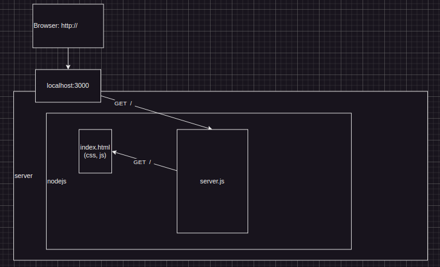
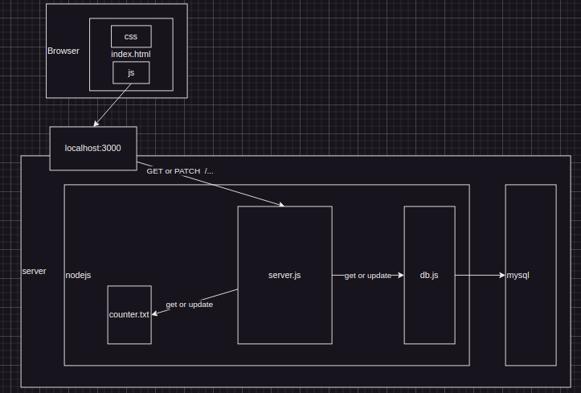

# web-dev-intro

Introduce how a web side works though simple demos

- run server:

  ```sh
  cd [path]
  node server.js
  ```

- visit: http://localhost:3000

- structure:

  - open page
    

  - handle data
    
